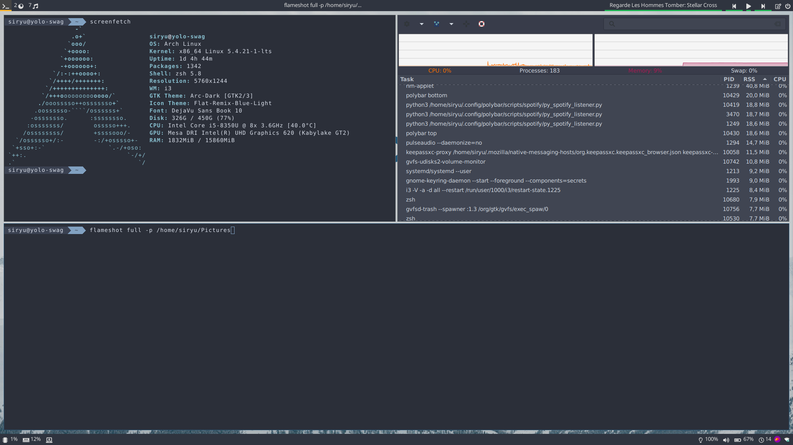

# I3conf

Some simple scripts to install and update and theme i3 with polybar and rofi.
It use light DM as display manager

I may have bind some DE and keyboard binding with programs that you don't use.
In ~/.config/i3/config just edit the "Custom binding conf"

I also Handle USB-c dock for my own needs. Check the polybar launching script of you want to use it. 

NB: this script is made for an Arch linux using pikaur as package manager.

## Screenshot



# Usage

First you'll have to clone the Repo
```bash
git clone https://github.com/Siryu6/sweet_i3
```

## Install for the first time (with dependencies)
```bash
cd i3conf
./i3_setup.sh # DON'T sudo it will setup the conf in /root and won't apply to your user !
# You'll get prompted for your password by pikaur 
```

## Update you're configuration
This will not install dependacies, the script only update your conf files with those from the git repo

```bash
cd i3conf
git pull
./i3_update.sh
```

## Update git local folder with your actual configuration

This script was intended for personnal usage, as I have to maintain my git, but it can be usefull if you want to upload and upgrade this conf on your own git.

```bash
cd i3conf
./git_update.sh
# then you can git push
```
NB: you can pull request if you made some improvements on scripts ;) I'll manage the conf diff !

# TODO 
- Make a backup of previous conf files before setup
- Conf file for recurent variables
- Beautify scripts prompt
- Error and exeption handeling

## Spotify module 

https://github.com/dietervanhoof/polybar-spotify-controls
